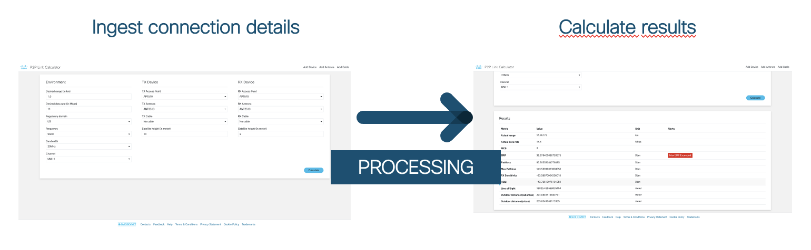
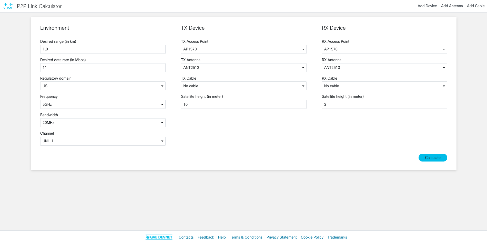
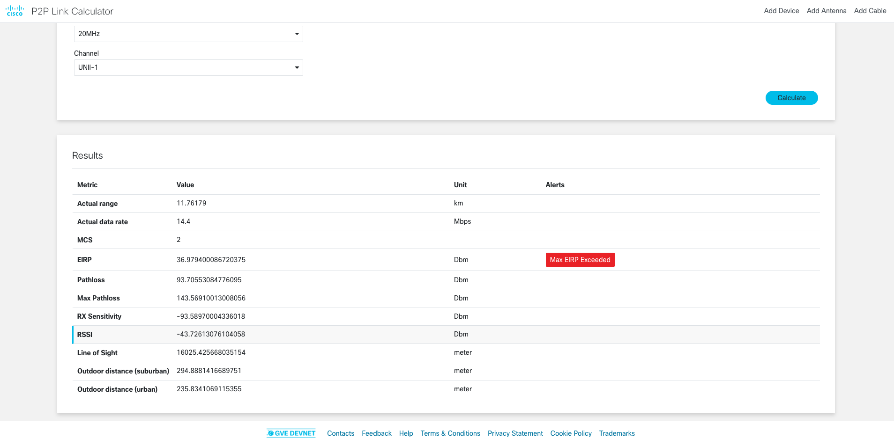
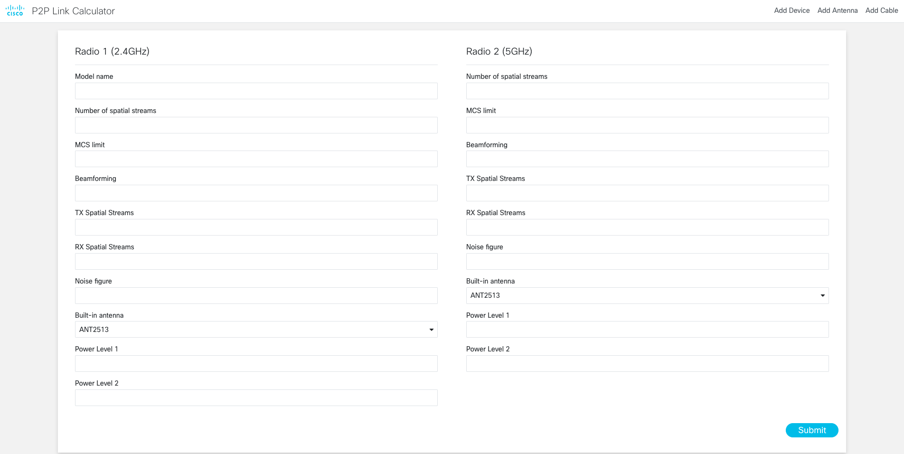
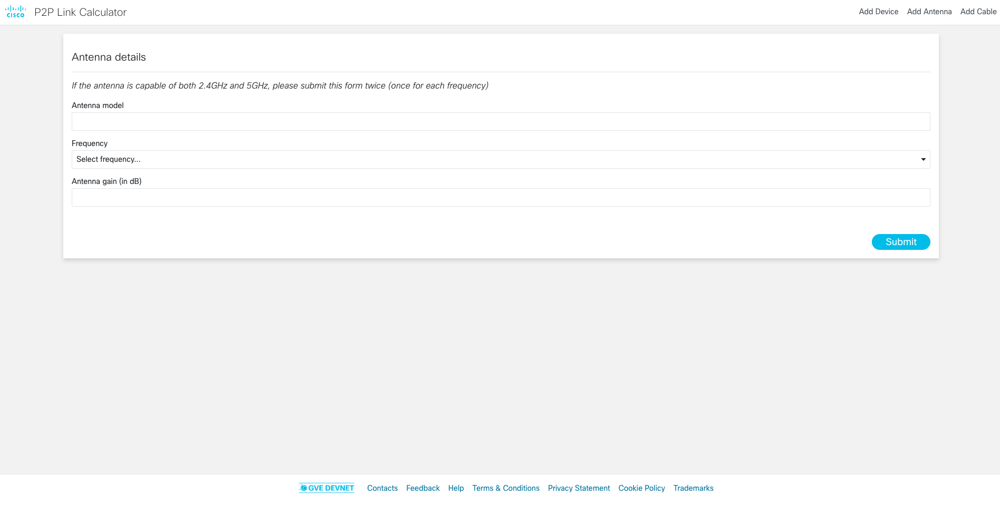
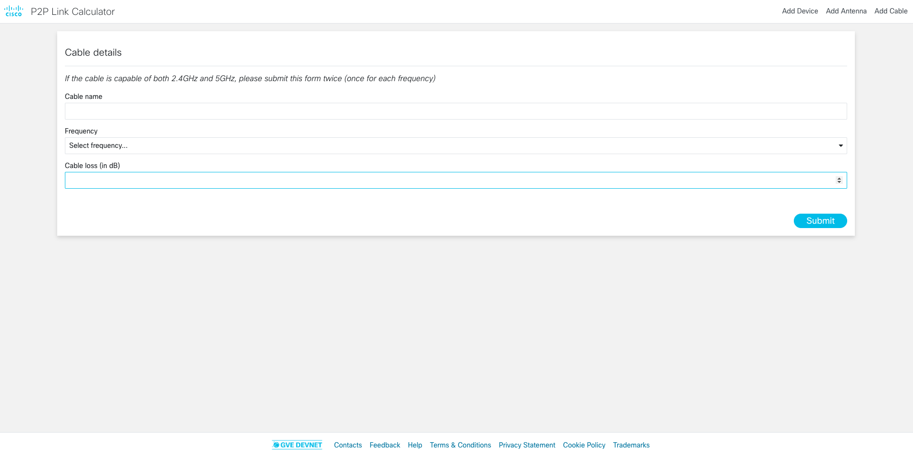

# GVE DevNet Wireless Link Calculator

This prototype is a web application that (1) takes a RX/TX wireless device, as well as environmentatl variables, and then (2) calculated various physical metrics (range, data rate, EIRP,...) for a peep-to-peer connection between the TX and RX device. 



## Installation/Usage

### Option 1: as a local Flask application

1. Clone this repository

```
$ git clone https://wwwin-github.cisco.com/stienvan/p2p-link-calculator/
```

2. Navigate to the code directory

```
$ cd p2p-link-calculator
```

3. Install the requirements

```
$ pip install -r requirements.txt
```

4. Run the app

```
$ python app.py
```

5. In a browser, navigate to `localhost:5678`

### Option 2: from a Docker image 

1. Install Docker Desktop [here](https://www.docker.com/products/docker-desktop)

2. Install Docker Compose

```
$ pip install docker-compose
```

3. Clone this repository
```
$ git clone https://wwwin-github.cisco.com/stienvan/p2p-link-calculator/
```

4. Navigate to the code directory

```
$ cd p2p-link-calculator
```

5. Build application

```
$ docker-compose down
$ docker-compose build
$ docker-compose up -d
```

6. In a browser, navigate to `localhost:5678`

### Option 3: on the Cisco Intranet

1. Connect to the Cisco intranet

2. In a browser, navigate to `https://emear-apps-test.cisco.com/p2ptool/`

## Screenshots

- **Landing page**: Enter environmental variables, transmitting device info, receiving device info



- **Result page**: Receive various physical metrics about the resulting connection



- **Device page**: Add a new device as a possible option to include
in a connection



- **Antenna page**: Add a new antenna as a possible option to include
in a connection



- **Cable page**: Add a new cable as a possible option to include
in a connection



### LICENSE

Provided under Cisco Sample Code License, for details see [LICENSE](LICENSE.md)

### CODE_OF_CONDUCT

Our code of conduct is available [here](CODE_OF_CONDUCT.md)

### CONTRIBUTING

See our contributing guidelines [here](CONTRIBUTING.md)

#### DISCLAIMER:
<b>Please note:</b> This script is meant for demo purposes only. All tools/ scripts in this repo are released for use "AS IS" without any warranties of any kind, including, but not limited to their installation, use, or performance. Any use of these scripts and tools is at your own risk. There is no guarantee that they have been through thorough testing in a comparable environment and we are not responsible for any damage or data loss incurred with their use.
You are responsible for reviewing and testing any scripts you run thoroughly before use in any non-testing environment.